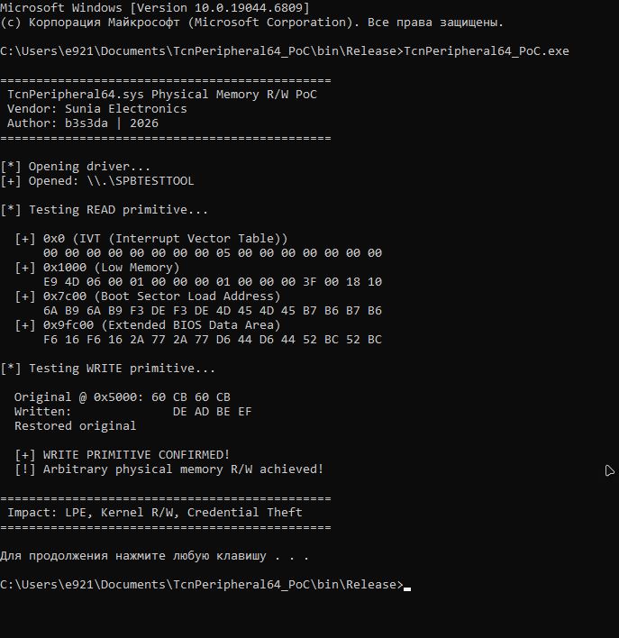
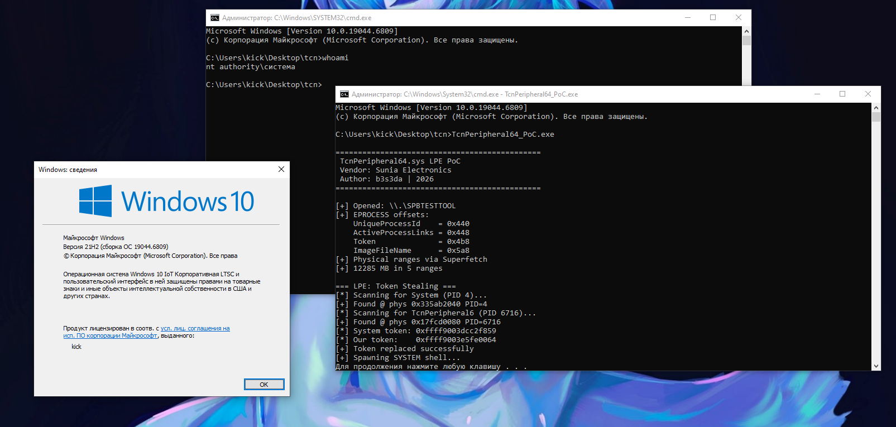

# CVE-2026-XXXX: Sunia SPB Peripheral Driver LPE

**Exploit Title:** Sunia SPB Peripheral Driver - Arbitrary Physical Memory Read/Write to Local Privilege Escalation  
**Date:** 2026-01-20  
**Exploit Author:** b3s3da  
**Vendor:** Sunia Electronics  
**Driver Version:** 1.0.7.2 (TcnPeripheral64.sys)  
**SHA256:** `fa4e294b11e613a27722559b043637bd4d0af5603ab7e8c7970caffd96cf7247`  
**Tested On:** Windows 10 x64 (21H2), Windows 11 x64 (24H2)  
**Vulnerability Type:** Local Privilege Escalation (LPE) via Arbitrary Physical Memory R/W  


---

## 📝 Description

The `TcnPeripheral64.sys` driver (Sunia SPB Peripheral Driver, shipped with certain Lenovo devices) contains a critical vulnerability in its IOCTL handler that allows unprivileged user-mode applications to map arbitrary physical memory with Read/Write permissions (`PAGE_READWRITE`).

The vulnerability resides in the dispatch routine for IOCTL `0x4002848`. The driver accepts a user-supplied physical address and size, then passes them directly to `MmMapIoSpace` / `ZwMapViewOfSection` backed by `\Device\PhysicalMemory`, without any validation of the requested address range or caller privileges.

An attacker with low-privilege code execution can leverage this to achieve full Local Privilege Escalation to `NT AUTHORITY\SYSTEM` by:

1. Scanning physical memory for `EPROCESS` kernel structures
2. Locating the `System` process (PID 4) and the attacker's process
3. Overwriting the attacker's process `Token` with the `System` token
4. Spawning a child process that inherits `SYSTEM` privileges

---

## 🔧 Technical Details

| Property | Value |
|----------|-------|
| **Vulnerable Driver** | `TcnPeripheral64.sys` |
| **Symbolic Link** | `\\.\SPBTESTTOOL` |
| **Vulnerable IOCTL** | `0x4002848` (Decimal: `67119176`) |
| **Vulnerable Function** | Subroutine at offset `0x2D08` |
| **Driver Hash (SHA256)** | `fa4e294b11e613a27722559b043637bd4d0af5603ab7e8c7970caffd96cf7247` |

> **Note:** The driver appears to be based on the Microsoft SpbTestTool sample, retaining the original symbolic link name.

### Vulnerability Root Cause

The IOCTL handler at `sub_140001120` (physical read) and `sub_140001290` (physical write) call `MmMapIoSpace` with user-controlled `PhysicalAddress` and `Size` parameters without any bounds checking:

```c
// Decompiled from sub_140001120 (Read Physical Memory)
v10 = MmMapIoSpace(*v6, v9, MmCached);   // v6 = user-supplied PhysAddr, v9 = user-supplied Size
memmove(v7, v10, v9);                      // copies to user output buffer
MmUnmapIoSpace(v11, v9);
```

No checks are performed on:
- The physical address range (allows mapping kernel memory, EPROCESS structures, page tables)
- The caller's privilege level (any user can send the IOCTL)
- The size of the mapping request

### IOCTL Structure

```cpp
// Input Buffer (40 bytes minimum)
struct MapRequest {
    uint64_t Size;            // Mapping size
    uint64_t PhysicalAddress; // Target physical address — NO VALIDATION
    uint64_t Reserved[3];     // Padding
};

// Output Buffer (40 bytes)
struct MapResponse {
    uint64_t Unknown1;
    uint64_t Unknown2;
    uint64_t SectionHandle;
    void*    MappedAddress;   // Userspace pointer to mapped physical memory
    uint64_t Object;
};
```

---

## ⚙️ Hardware Initialization Bypass (BYOVD Context)

The driver includes a `Hardware Init` check (`sub_1400017A0`) that verifies the presence of specific ACPI resources (GPIO/Interrupts) before enabling the IOCTL interface. On standard systems without Sunia hardware, the driver fails to initialize, returning `Error 1` (`ERROR_INVALID_FUNCTION`).

**Exploitation Technique:** To exploit this vulnerability on arbitrary targets (Bring Your Own Vulnerable Driver scenario), the driver must be manually bound to legacy system resources. This bypasses the initialization check by forcing the driver to attach to an existing system device.

---

## 🚀 Proof of Concept

The PoC (`src/main.cpp`) demonstrates full LPE from unprivileged user to `NT AUTHORITY\SYSTEM`:

1. Opens the driver via `\\.\SPBTESTTOOL` symbolic link
2. Dynamically resolves `EPROCESS` offsets from `ntoskrnl.exe` exports (`PsGetProcessId`, `PsGetProcessImageFileName`, `PsReferencePrimaryToken`) — works across Windows versions without hardcoded offsets
3. Enumerates physical memory ranges via Superfetch API (`NtQuerySystemInformation` class 79)
4. Scans physical memory for `EPROCESS` structures by matching `ImageFileName`, validating `ActiveProcessLinks` (kernel pointers), and `UniqueProcessId`
5. Copies the `System` process token to the exploit's `EPROCESS`
6. Spawns `cmd.exe` running as `NT AUTHORITY\SYSTEM`

### Driver Installation (Bypass Setup)

Since the target machine likely lacks the specific Sunia hardware, install the driver using the "Legacy Hardware" method:

1. Open **Device Manager** (`devmgmt.msc`)
2. Select **Action** → **Add legacy hardware**
3. Choose **"Install the hardware that I manually select from a list"**
4. Select **"System devices"** → **Next**
5. Click **"Have Disk..."** and browse to `TcnPeripheral64.inf`
6. Select **"Sunia SPB Peripheral Driver"** and complete the installation

> This binds the driver to generic system resources, satisfying the internal hardware init check.

---

## 📸 Screenshots

Arbitrary physical memory read/write:

<p align="center">
  
</p>

Local Privilege Escalation — token stealing to `NT AUTHORITY\SYSTEM`:

<p align="center">
  
</p>

---

## 💥 Impact

| Attack Vector | Description |
|---------------|-------------|
| **Kernel Memory Read** | Read arbitrary physical memory including kernel structures |
| **Kernel Memory Write** | Modify kernel memory to escalate privileges |
| **Token Manipulation** | Overwrite process token to gain SYSTEM privileges |
| **Security Bypass** | Disable EDR/AV by patching kernel callbacks |
| **Credential Theft** | Access LSASS memory for credential extraction |

---

## ⚠️ Disclaimer

This research is for **educational purposes and authorized security testing only**. The author takes no responsibility for any unauthorized use of this information. Unauthorized access to computer systems is illegal.

---
